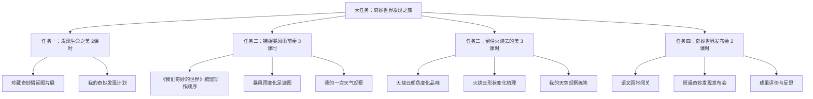

# 三年级下册第七单元大单元教学设计学习成果

> 学习自一线教师实际教学设计案例，整理于 2026-03-20

## 一、单元整体定位

### 单元基本信息
- **教材**：统编版小学语文三年级下册第七单元（新版）
- **单元篇目**：《我们奇妙的世界》、《暴风雨来临之前》、《火烧云》
- **单元主题**：奇妙的世界
- **语文要素**：
  - 阅读：了解课文内容，初步理清顺序
  - 习作：初步学习整合信息，介绍一种事物
- **课时总量**：10课时

### 大概念提炼
> **世界的奇妙藏在瞬息万变的自然景象中，通过"细致观察-抓住变化-有序表达"，把看到的景象写清楚**

大概念不是知识点，是可迁移的核心观念，学生学完这个单元后能带走的东西。

### 四维目标（新课标要求）

| 维度 | 目标描述 |
|------|----------|
| **文化自信** | 感受世界的奇妙美好，培养热爱自然、热爱生活的情感，激发探索世界奥秘的兴趣 |
| **语言运用** | 认识35个生字，会写33个字，积累好词佳句；能正确流利朗读课文；学习作者从不同方面把事物介绍清楚的方法 |
| **思维能力** | 培养有序观察、有序思考的习惯，发展信息整合能力和逻辑思维 |
| **审美创造** | 发现自然之美、科学之美，能用语言文字表达自己的审美体验 |

### 单元语文要素解读
新版教材这个单元三篇课文都是围绕**"观察变化中的景象"**来选编的：
- 《我们奇妙的世界》——从时间顺序写天空和大地的四季变化
- 《暴风雨来临之前》——一步步写暴风雨来临前天气的变化过程
- 《火烧云》——细致描写火烧云颜色和形状的快速变化

整个单元的训练点非常集中：**学习按一定顺序写出事物的变化**。

### 对应学习任务群
- 核心：**文学阅读与创意表达**
- 融合：**思辨性阅读与表达**、**实用性阅读与交流**

---

## 二、大单元任务群架构设计

整个单元设计为 **4个大任务**，形成"整体感知 - 部分探究 - 整体运用"的学习链条：

### 任务一：发现生命之美——单元起始课（2课时）

#### 核心活动设计：

1. **"珍藏奇妙瞬间"照片分享会**
   - 课前：让学生拍一张自己觉得"奇妙"的照片
   - 课中：小组内轮流分享，这张照片哪里奇妙？
   - 全班交流：你最感兴趣的是谁的发现？
   - 教师引出：作家们也发现了很多奇妙的事物，这单元我们一起去看看

2. **单元整体浏览**
   - 浏览单元目录、课文导语、语文园地
   - 说一说：这单元我们要学什么？要做什么？
   - 完成"我的奇妙发现计划"：我准备观察什么事物？

**设计亮点**：从学生真实生活切入，激活经验，单元学习就有了"根"。

---

### 任务二：捕捉暴风雨前奏（3课时）

| 课时 | 内容 | 核心活动 |
|------|------|----------|
| 第1课时 | 《我们奇妙的世界》 | 梳理作者从哪几个方面写天空和大地的奇妙 |
| 第2课时 | 《暴风雨来临之前》 | 跟着作者一起捕捉暴风雨前的变化足迹 |
| 第3课时 | 方法迁移练习 | 记录并整理"我的一次天气观察" |

#### 核心活动亮点：

**"暴风雨变化足迹图"绘制活动**：
- 学生自由读课文，圈画出文中表示时间顺序的词语
- 小组合作，画出"暴风雨来临之前变化图"：
  - 第一层：一开始——天气闷热，闪电微弱
  - 第二层：接着——风来了，树枝摇动
  - 第三层：然后——乌云满天，电闪雷鸣
  - 第四层：最后——大雨就要来了
- 各小组展示：作者是怎样一步步写出暴风雨来临前变化的？
- 讨论发现：按时间顺序写变化，能让读者清楚感受到过程

**"我的一次天气观察"迁移练习**：
- 让学生回忆自己经历过的特殊天气（下雪、起雾、彩虹...）
- 小组交流：当时天气变化的顺序是怎样的？
- 动笔写：用几句话按顺序写出变化过程
- 交换修改：同桌看看，对方写清楚顺序了吗？

---

### 任务三：留住火烧云的美（3课时）

| 课时 | 内容 | 核心活动 |
|------|------|----------|
| 第1课时 | 《火烧云》初读+颜色变化 | 积累表示颜色的词语，品味作者怎么写颜色 |
| 第2课时 | 《火烧云》形状变化+写法总结 | 理解作者是怎么把形状变化写清楚的 |
| 第3课时 | 迁移练笔 | 写"我的一次天空观察" |

#### 核心活动亮点：

**"火烧云变化 timeline"活动**：
- 学生自主阅读，梳理火烧云变化的过程：
  - 上来了→变化着→下去了
- 聚焦变化：颜色变化了几次？形状变化了几次？
- 小组讨论：为什么作者能写得这么生动？

**"我的天空观察"仿写**：
- 课前任务：连续几天观察傍晚的天空，记下一次你看到的奇妙变化
- 课中：模仿课文写法，写一段自己看到的天空景象
- 要求：写出变化的过程，按顺序来写
- 小组互评：同桌互相评一评，顺序清楚吗？变化写明白了吗？

---

### 任务四：语文园地闯关 · 奇妙世界发布会（2课时）

| 课时 | 内容 | 核心活动 |
|------|------|----------|
| 第1课时 | 语文园地 | 词句段运用 + 日积月累 |
| 第2课时 | 单元成果发布 | "奇妙世界发布会" |

#### 核心活动亮点：

**"奇妙世界发布会"成果展示**：
- 前期准备：每个学生完成一篇习作——介绍一种自己观察的奇妙事物
- 布置会场：教室分成几个"发布区"
- 发布会流程：
  1. 每个同学轮流上台展示自己的发现
  2. 听众可以提问
  3. 全班投票评选三个奖项：
     - 🎖️ 最奇妙发现奖
     - 🎖️ 最清楚表达奖
     - 🎖️ 最具创意奖
- 优秀习作装订成班级《奇妙发现集》

---

## 三、整体任务结构图

---

## 四、评价设计

### 过程性评价：奇妙发现存折

- 给每个学生发一张"奇妙发现存折"
- 完成一个任务盖一个"发现章"
- 积累了好词好句可以"存入存折"
- 上课积极发言也可以"存款"
- 单元结束看谁的"存款"最多

### 终结性评价：习作评价量规

| 评价维度 | 评价标准 | 星级 |
|----------|----------|------|
| **内容** | 抓住了事物的主要特点，有自己的发现 | ★★★★★ |
| **结构** | 从不同方面介绍，顺序清楚，条理分明 | ★★★★★ |
| **语言** | 语句通顺，能用上积累的好词 | ★★★★★ |
| **创意** | 有自己独特的观察和感受 | ★★★★★ |

### 多元评价主体
- 学生自评：我给自己打几颗星？
- 同伴互评：同桌给我提建议
- 教师评价：教师给出综合性评价和鼓励

---

## 五、一线实践经验总结

### 1. AI与大单元教学融合的可行路径

一线教师不是为了炫AI，而是真解决问题：

| 应用场景 | 具体用法 |
|----------|----------|
| **情境创设** | AI生成海底声音、火烧云变化短视频，帮助学生建立直观感受 |
| **资料搜集** | 学生要介绍某种事物，AI帮忙整理基础资料，学生再整合 |
| **初稿修改** | 学生写完初稿，AI先给修改建议，教师再针对性指导，减轻负担 |
| **口语练习** | 胆小的学生先和AI练习分享，再上台展示，更有信心 |

### 2. 语文要素要"一以贯之"

- 单元一开始就扣住"从不同方面把事物写清楚"
- 每篇课文都在"学方法"
- 每个练习都在"用方法"
- 最后的习作就是"综合用方法"
- 整个单元螺旋上升，不跑偏，不丢语文本真

### 3. 小切口，真探究，不贪大

- 不一定每个大单元都要搞跨学科大项目
- 引导学生观察身边事物：校园的树、家里的小猫、天上的云
- 学生有真实生活经验，有话可说
- 把小事做扎实，比空架子大项目更有效

### 4. 成果可视化，学生有成就感

- 最后的成果一定要"看得见、摸得着"
- 一本班级作文集、一次发布会、一个作品展
- 学生能看到自己的学习成果，成就感强，兴趣就浓

### 5. 需要避免的误区

❌ **不要把语文课上成科学课**：无论多么奇妙的世界，最终都要落在语言文字运用上  
❌ **不要丢掉识字写字**：大单元不是不要基础，基础训练要整合在任务中  
❌ **不要教师包办**：真任务要真放手，让学生真观察、真思考、真表达  
❌ **不要为了大而大**：不是所有单元都适合做大单元，要根据内容特点设计

---

## 六、我的学习体会

这个案例给我的启发是：

1. **好的大单元设计贴近学生生活**，从学生真实经验出发，不是从理论出发
2. **任务设计有进阶性**，从整体到部分再到整体，循序渐进
3. **始终紧扣语文要素**，不丢语文本真
4. **评价设计关注过程**，不仅仅看最终习作
5. **AI是工具，服务于教学，不是为了炫技**

这个设计整体来说比较接地气，一线教师拿过去基本上就可以直接用，不需要太多额外准备。
